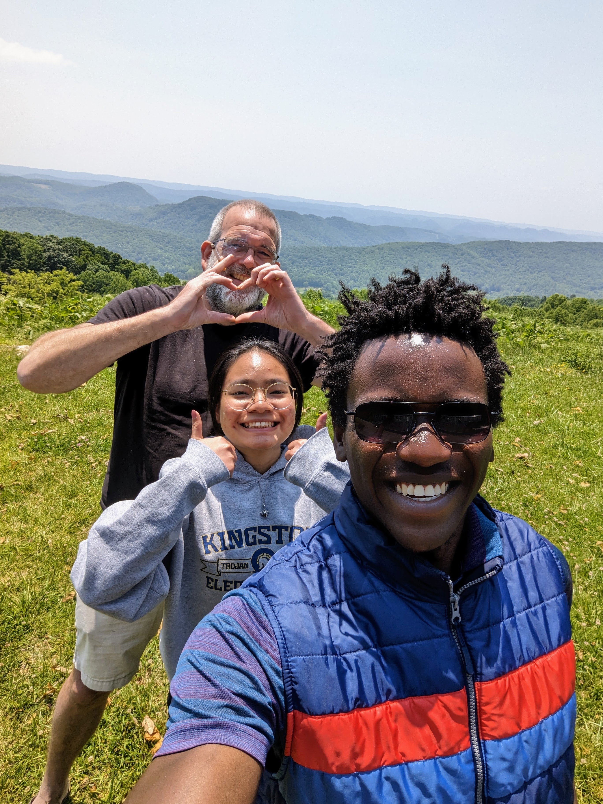
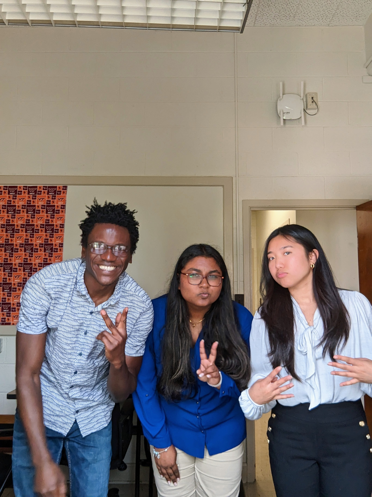
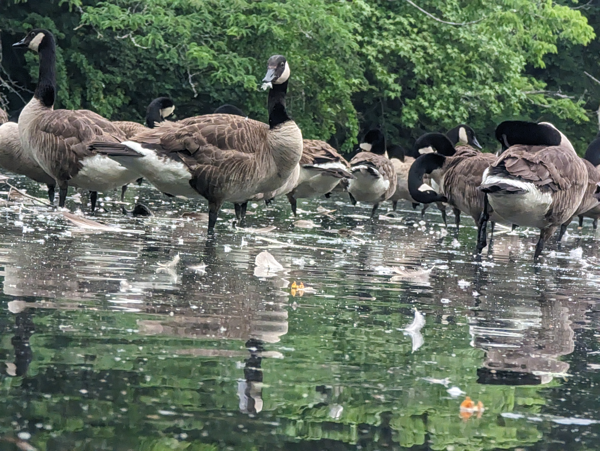
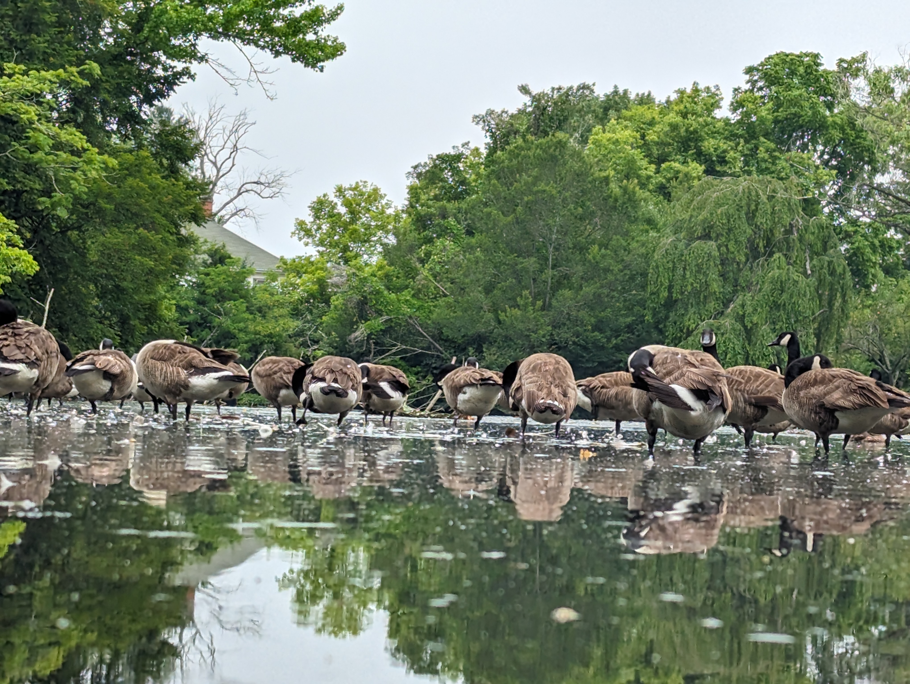

  <a href="#Professional">Professional</a>
  <a href="#Casual">Casual</a>
  <a href="#Adventure">Adventure</a>

## Professional 

Write a brief description

## Casual 

  <figure>
    
    <figcaption>Dr. Volker and his taking a driving break on their way to Blacksburg, Virginia</figcaption>
  </figure>
  <figure>
    
    <figcaption>Caption for Image 2</figcaption>
  </figure>
  <figure>
    
    <figcaption>Caption for Image 3</figcaption>
  </figure>
  <figure>
    
    <figcaption>Caption for Image 3</figcaption>
  </figure>

## Adventure 

  <figure>
    
    <figcaption>VT famous Duck Pond / Photo by Sotaire Kwizera </figcaption>
  </figure>
  <figure>
    
    <figcaption>VT Duck Pond</figcaption>
  </figure>
 

  101 Chestnut Street  / CPO: 779 / 
  Berea, KY, 40404 / 
  [(859) 979-6935](tel:+1234567890)

